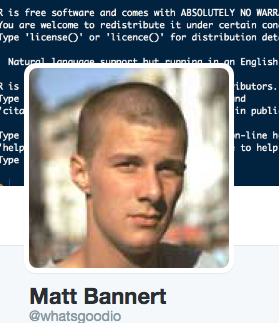
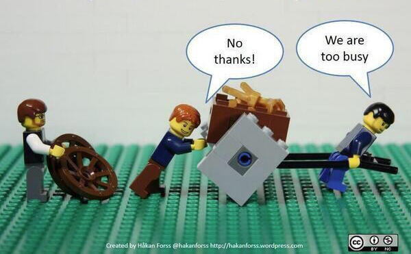

```{r setup, include=FALSE}
knitr::opts_chunk$set(echo = FALSE)
```

## :~$ whoami

**Matthias Bannert**

- studied economics @UniKN
- PhD @ETHZ: partly economics, mostly methodology and stats
- currently: develops software for academic researchers @ETHZ
- open source software projects: timeseriesdb, dropR, RAdwords
- teaching: Programming, data visualization, stats

<div align="right">
</div>


## Background Poll

```{r,echo=FALSE}
library(grid)
library(shiny)
source("bullet.R")

fluidPage(sidebarLayout(sidebarPanel(
  numericInput("members", "Number of participants", 16),
  numericInput("rstats", "R language", 16),  
  numericInput("functions", "Own functions", 16),
  numericInput("git", "git version control", 16)
  ),
  mainPanel(
    renderPlot({
      techavg <- mean(c(input$rstats,
                        input$functions,
                        input$git) / input$members)*100
  df1 <- data.frame(units = c("R(%)","Fcts.(%)","git(%)"),
                    low = c(25,25,25),
                    mean = c(50,50,50),
                    high = c(100,100,100),
                    target = c(techavg,techavg,techavg),
                    value = c(100*(input$rstats/input$members),
                              100*(input$functions/input$members),
                              100*(input$git/input$members)
                              )
                    )

  g <- gridBulletGraphH(df1,bcol = c("#999999","#CCCCCC","#E1E1E1"),
                   vcol = "#333333",font = 20)

  g + title(paste("Usage of Technologies Among Participants", sep=" "))

})  


    )
  ))

```

## Course organization

- today: get to know each other, software set up, background check

- Fri, May 12: discuss package ideas, First functions, R and data

- Sat, May 13: introduction to collaboration with git, how-to-package using R Studio, plotting with R

- Fri, June 16: R Markdown and context aware documentation, Q&A

- Sat, June 17: Working on own packages (workshop)

- Assignments due: **August 31**


## About this course: Grading

- work in groups (2-3 people), individual specific grading possible

- write own R package

- make a presentation to be held on last saturday morning

- helping out others 


## About this course: Goals

<div>
  
</div>

- write a package collaboaratively

- make stuff run elsewhere (deployment)


## About this course: Approach

learning by doing:

- listen - forget

- see - remember

- do - understand

=> collaboration


## Inspiration

- 10497 packages available on [CRAN](https://cran.r-project.org/)

- [CRAN Task views](https://cran.r-project.org/web/views/) help to monitor packages

- [WG SuchR](https://github.com/jansim/WG-SuchR) an interactive app by Jan Simson and Sophie Breunig developed during the BOAR course


## Before you start... 

**... check the stack:**

- R 3.3.1+
- R Studio 1.0+
- R packages: devtools
- git 

## Guess what...

**... the following code does:**

```{r,echo=T}
a <- 1+1
b <- 2+2
d <- a + b
e <- c(1,2,4)

```

## You got this right, don't you?

```{r,echo=T,eval=F}
a <- 1+1
b <- 2+2
d <- a + b
e <- c(1,2,4)

```

```{r}
a
b
d
e
```

## Guess what...

**... the following code does:**

```{r,echo=T}
m <- matrix(1:12,4,3)
d <- data.frame(col1 = 1:8,
                col2 = letters[1:8])
l <- list()
l$element_a <- a
l$element_m <- m
l$element_d <- d
```

## You got this right, don't you?

```{r,echo=T,eval=F}
m <- matrix(1:12,4,3)

```

```{r}
m
```

## You got this right, don't you?

```{r,echo=T,eval=F}
d <- data.frame(col1 = 1:8,
                col2 = letters[1:8])

```

```{r}
d
```

## You got this right, don't you?

```{r,echo=T,eval=F}
l <- list()
l$element_a <- a
l$element_m <- m
l$element_d <- d

```

```{r}
l
```

## You know all of those, don't you?

```{r,eval=F,echo=T}
?sum()
ls()
c()
matrix()
data.frame()
list()
head()
tail()
str()
function()
lapply()
```

## Habits: researcher vs. professional developer

```{r,eval = FALSE, echo = T}
a <- 1
b <- 2
x <- 4
d <- a+b
o <- x*d
o

compute <- function(a,b,x) (a+b)*x
compute(1,2,4)
compute(3,2,1)

```


## Are you familiar with your R Studio IDE?

- script window
- console
- file browser
- .Rproj


## Beyond R: Collaborate like pro developers

- version controlled development /w git and github

- register to get a free account on [github.com](https://github.com/)


## Some introductory resources

- [Official Introduction to R](https://cran.r-project.org/doc/manuals/R-intro.pdf) ( chapter 2)
- [stackoverflow questions tagged r](http://stackoverflow.com/questions/tagged/r)

- [stackoverflow user written documentation R](http://stackoverflow.com/documentation/r/topics)

- [introduction to git](https://git-scm.com/book/en/v2/Getting-Started-Git-Basics)

- [Interactive git learning challenge](https://try.github.io/levels/1/challenges/1)

- **!Tip**: Read other people's source code to learn!


